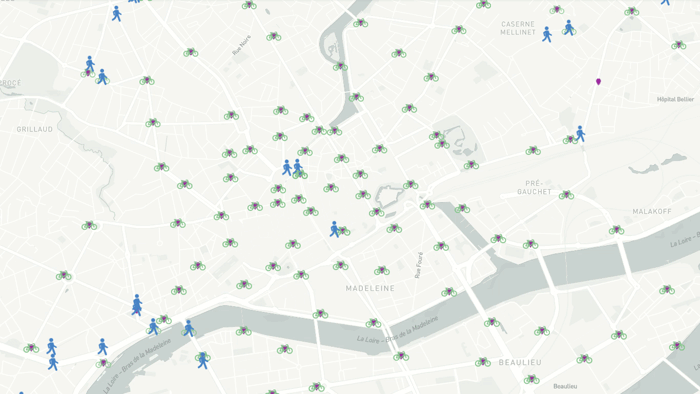

# Starling

**Starling** is an agent-based simulation framework for urban mobility.

It provides generic classes to build transport models such as station-based sharing system,
public transport or shared taxis.

**Citation info**: Leblond, V, Desbureaux, L, Bielecki, V., 2020. "[A new agent-based software for designing and optimizing emerging mobility services : application to city of Rennes](https://aetransport.org/past-etc-papers/conference-papers-2020?abstractId=6706&state=b)." *Proceedings of the European Transport Conference*, 11 September 2020, Milan



## License

[CeCILL-B](LICENSE.txt)

Feel free to use and contribute to **Starling** project as long as you comply with the licence terms.

## Quickstart

This section will show you how to run the example simulation scenarios.

For a more detailed setup guide, see the section **Running simulations**
of the documentation.

### Installation

Starling must be cloned locally in order to be run.

```bash
git clone https://github.com/tellae/starling.git
```

Then, you can either install the dependencies directly on your linux or
use a Docker container to run a simulation.

We recommend the Linux installation for development and the Docker installation for running simulations.

#### Linux (Ubuntu)

This procedure is described for a Linux Ubuntu 18.04 with Python 3.6 or higher already installed.

First, install the necessary Linux packages with

```bash
sudo apt-get install -yy -q libcurl4-gnutls-dev \
    libssl-dev libproj-dev libgdal-dev gdal-bin python3-gdal \
    libgdal-dev libudunits2-dev pkg-config libnlopt-dev libxml2-dev \
    libcairo2-dev libudunits2-dev \
    libgdal-dev libgeos-dev libproj-dev python3-pip python3-dev \
    build-essential libspatialindex-dev python3-rtree
```

Then, install the Python libraries using pip3

```bash
# upgrade pip
python3 -m pip install --upgrade pip
# install the project requirements
pip3 install -r requirements.txt
```

#### Docker

Run the following command
to create a Docker image named starling
containing python and all requirements.
This image doesn’t contain Starling source code but it
contains all python dependencies for running Starling.

```bash
docker build . --tag="starling"
```

You can now use this image to create Docker containers to run the framework.
Use the -v option to mount the Starling repository in the container.

The Dockerfile create a new Linux user named 'starling_user'. If you need to use sudo,
the password is also 'starling_user'.

You can either use Docker in detached mode (which lets the simulations
run on their own)

```bash
docker run -d -v "$(pwd)":/starling_dir/ --name container_name starling\
    bash -c "my_command -option"
```

or in interactive mode (which will place you inside the container,
as in a terminal)

```bash
docker run -it -v "$(pwd)":/starling_dir/ --name container_name starling
```

### Download examples

You can now build the data structure and download example scenarios by
running the following command in your environment

```bash
python3 main.py -e
```

### Usage

Once the data is prepared, a scenario can be run from the project
root by running main.py with the path to the scenario parameters.

Run one of the example scenarios, for instance:

```bash
python3 main.py data/models/SB_VS/example_nantes/inputs/Params.json
```

You will see the progression of the simulation with the logs that
appear in the console.

### Outputs

You can find the outputs of the scenario in the output folder.
In this case, its data/models/SB_VS/example_nantes/outputs/.

KPI files (.csv.bz2) can be visualised with any spreadsheet software.

The visualisation file (.geojson) can be uploaded to the web application
[Kite](https://kite.tellae.fr/) to visualise the simulation run.

## Documentation

For now, the documentation of the project and its code can only be
generated locally with the following command

```bash
python3 main.py -S
```

Then the overview file can be opened in your navigator. For instance

```bash
firefox ./docs/_build/html/overview.html
```

## Contributing

Feedback and contributions on Starling, the code, the documentation or
even the github management are very welcome.

We haven't established a contributing procedure yet, but we will do our
best to guide you if you want to contribute to this project.

## Support

You can email us at starling@tellae.fr for any support demand.

## Project status

[*Tellae*](https://tellae.fr/) is actively contributing to Starling as part of its research and development activities.

Tellae uses Starling in commercial contracts to study mobility projects. This is why
some of the models and algorithms developed around Starling are not shared in this repository.
